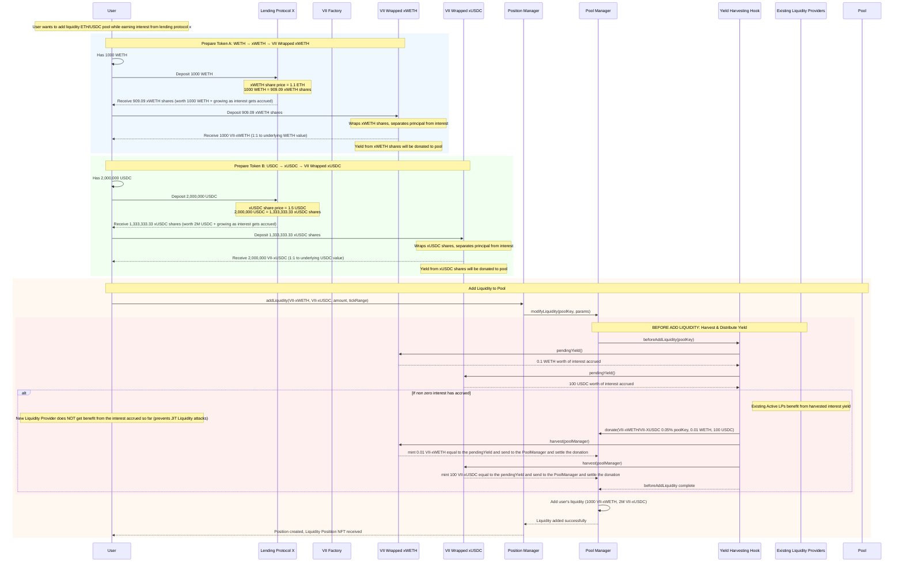

```mermaid
sequenceDiagram
    participant User
    participant LendingProtocolX as Lending Protocol X
    participant VIIFactory as VII Factory
    participant VIIWrapperWETH as VII Wrapped xWETH
    participant VIIWrapperUSDC as VII Wrapped xUSDC
    participant PositionManager as Position Manager
    participant PoolManager as Pool Manager
    participant YieldHook as Yield Harvesting Hook
    participant ExistingLPs as Existing Liquidity Providers

    Note over User: User wants to add liquidity ETH/USDC pool while earning interest from lending protocol x

    %% Step 1: Prepare Token A (WETH -> xWETH -> VII Wrapped xWETH)
    rect rgb(240, 248, 255)
        Note over User, VIIWrapperWETH: Prepare Token A: WETH → xWETH → VII Wrapped xWETH
        User->>User: Has 1000 WETH
        User->>LendingProtocolX: Deposit 1000 WETH
        Note over LendingProtocolX: xWETH share price = 1.1 ETH<br/>1000 WETH = 909.09 xWETH shares
        LendingProtocolX-->>User: Receive 909.09 xWETH shares (worth 1000 WETH + growing as interest gets accrued)
        User->>VIIWrapperWETH: Deposit 909.09 xWETH shares
        Note over VIIWrapperWETH: Wraps xWETH shares, separates principal from interest
        VIIWrapperWETH-->>User: Receive 1000 VII-xWETH (1:1 to underlying WETH value)
        Note over VIIWrapperWETH: Yield from xWETH shares will be donated to pool
    end

    %% Step 2: Prepare Token B (USDC -> xUSDC -> VII Wrapped xUSDC)
    rect rgb(240, 255, 240)
        Note over User, VIIWrapperUSDC: Prepare Token B: USDC → xUSDC → VII Wrapped xUSDC
        User->>User: Has 2,000,000 USDC
        User->>LendingProtocolX: Deposit 2,000,000 USDC
        Note over LendingProtocolX: xUSDC share price = 1.5 USDC<br/>2,000,000 USDC = 1,333,333.33 xUSDC shares
        LendingProtocolX-->>User: Receive 1,333,333.33 xUSDC shares (worth 2M USDC + growing as interest gets accrued)
        User->>VIIWrapperUSDC: Deposit 1,333,333.33 xUSDC shares
        Note over VIIWrapperUSDC: Wraps xUSDC shares, separates principal from interest
        VIIWrapperUSDC-->>User: Receive 2,000,000 VII-xUSDC (1:1 to underlying USDC value)
        Note over VIIWrapperUSDC: Yield from xUSDC shares will be donated to pool
    end

    %% Step 3: Add Liquidity Through Position Manager
    rect rgb(255, 248, 240)
        Note over User, Pool: Add Liquidity to Pool
        User->>PositionManager: addLiquidity(VII-xWETH, VII-xUSDC, amount, tickRange)
        PositionManager->>PoolManager: modifyLiquidity(poolKey, params)

        %% Step 4: Yield Harvesting Hook Execution (BEFORE adding liquidity)
        rect rgb(255, 240, 240)
            Note over PoolManager, ExistingLPs: BEFORE ADD LIQUIDITY: Harvest & Distribute Yield
            PoolManager->>YieldHook: beforeAddLiquidity(poolKey)

            YieldHook->>VIIWrapperWETH: pendingYield()
            VIIWrapperWETH-->>YieldHook: 0.1 WETH worth of interest accrued

            YieldHook->>VIIWrapperUSDC: pendingYield()
            VIIWrapperUSDC-->>YieldHook: 100 USDC worth of interest accrued

            alt If non zero interest has accrued
                Note over ExistingLPs: Existing Active LPs benefit from harvested interest yield
                Note over User: New Liquidity Provider does NOT get benefit from the interest accrued so far (prevents JIT Liquidity attacks)

            
    
                YieldHook->>PoolManager: donate(VII-xWETH/VII-XUSDC 0.05% poolKey, 0.01 WETH, 100 USDC)
    
                YieldHook->>VIIWrapperWETH: harvest(poolManager) 
                VIIWrapperWETH-->>PoolManager:  mint 0.01 VII-xWETH equal to the pendingYield and send to the PoolManager and settle the donation
                YieldHook->>VIIWrapperUSDC: harvest(poolManager)
                VIIWrapperUSDC-->>PoolManager: mint 100 VII-xUSDC equal to the pendingYield and send to the PoolManager and settle the donation
    
          
    
                YieldHook-->>PoolManager: beforeAddLiquidity complete
            end
        end

        %% Step 5: Actual Liquidity Addition
        PoolManager->>PoolManager: Add user's liquidity (1000 VII-xWETH, 2M VII-xUSDC)
        PoolManager-->>PositionManager: Liquidity added successfully
        PositionManager-->>User: Position created, Liquidity Positiion NFT received
    end
```
